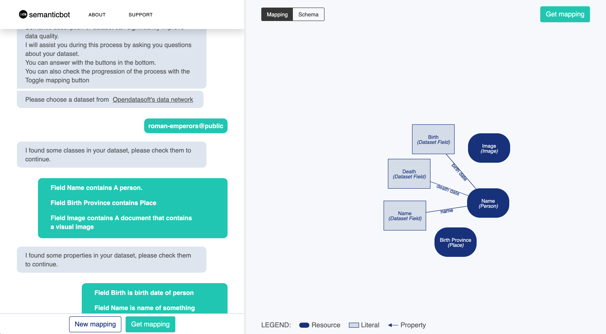
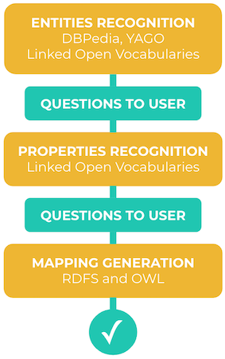
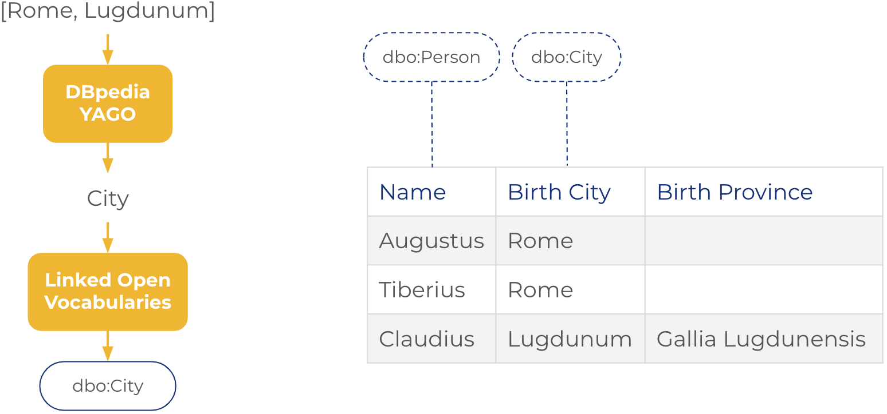
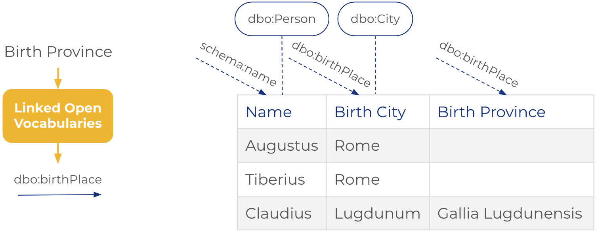
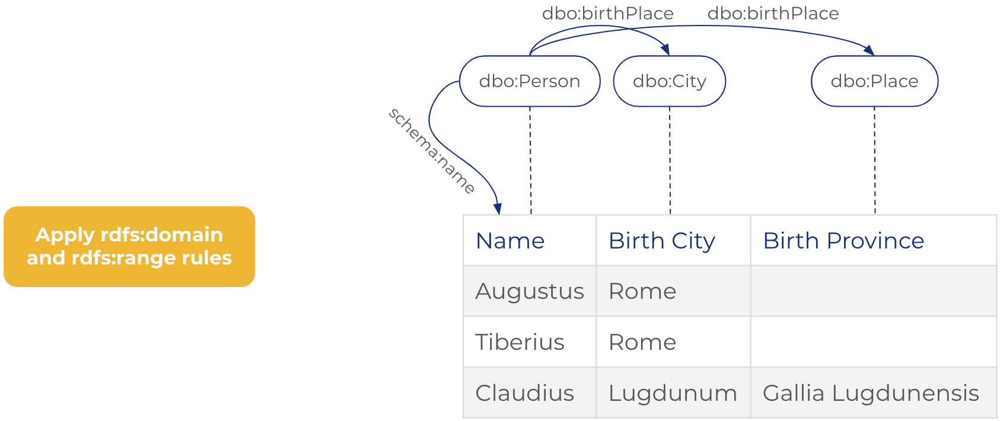
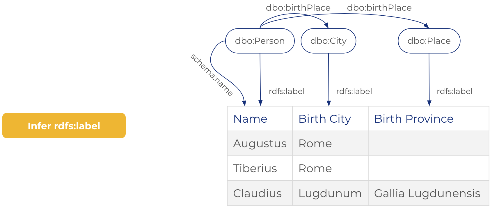
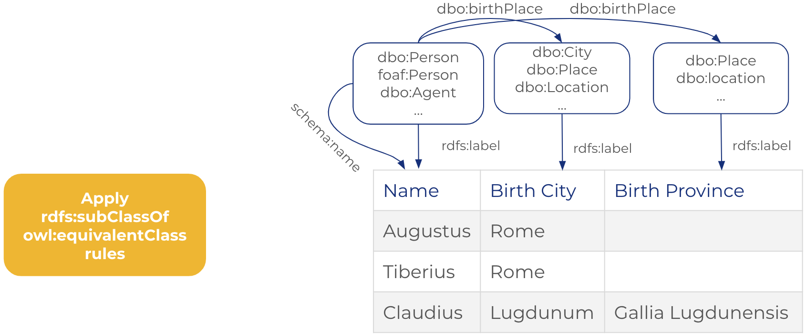
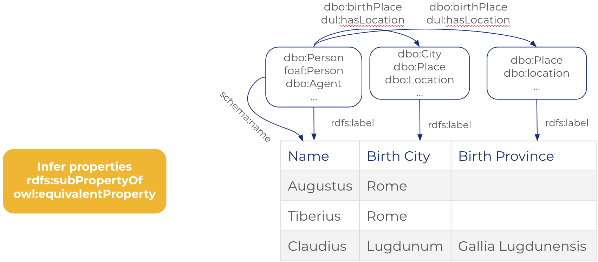
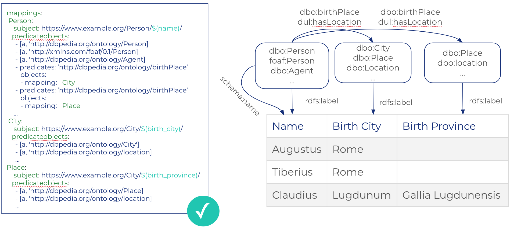

# SemanticBot

[](https://travis-ci.org/opendatasoft/ontology-mapping-chatbot)

SemanticBot is a semi-interactive ontology mapping tool. It provides an easy-to-use interface in order to semantize (i.e. to map ontologies on) OpenDataSoft datasets.


# Publication

For more details, you can read the following demonstration paper:

[Benjamin Moreau, Nicolas Terpolilli, Patricia Serrano-Alvarado. A Semi-Automatic Tool for Linked Data Integration. 18th International Semantic Web Conference (ISWC2019), Oct 2019, Auckland, New Zealand.](https://hal.archives-ouvertes.fr/hal-02194315/document)

# Glossary

## DBPedia
[DBpedia](https://wiki.dbpedia.org/) is a knowledge graph containing informations extracted from wikipedia .
SemanticBot uses DBpedia to perform named entity recognition. In other word, to find class of entities (e.g., Italia is a country/PopulatedPLace.. or B.Obama is a President/Person..)

## YAGO
[YAGO](https://www.mpi-inf.mpg.de/departments/databases-and-information-systems/research/yago-naga/yago/) is an other knowledge graph that is used for named entity recognition by the SemanticBot.

## LOV (Linked Open Vocabularies)
[LOV](http://lov.okfn.org/) is an ontology search engine. It is used by the SemanticBot to find candidate ontologies for opendatasoft datasets.

## Ontology (Vocabulary)
An `ontology` is a vocabulary defining the concepts and relationships used to describe an area of concern.
It's composed of:
* `classes` (e.g. Car, Building, Person, Disease, Source Code) to represent a concept.
* `properties` (e.g. horsepower, financed By, date of birth, has Symptoms, Author) to represent relation between concepts.
* `rules` (e.g. A person have a unique date of birth).
Ontologies can be created for every area of concern and by everyone using RDF (Resource Description Framework), RDFS (RDF Schema) and OWL (Web Ontology Language).

## HDT
[HDT](http://www.rdfhdt.org/) (Header, Dictionary, Triples) is a compact data structure and binary serialization format for RDF

## RML & YARRRML
[RML](http://rml.io/) is a generic mapping language to describe multi-format to RDF transformations. [YARRRML](http://rml.io/yarrrml/) is a simple syntax to respresent RML rules.

# Installation
Assuming you already have `python 3.6`, `pip`, `yarn and gcc/clang with c++11 support,

Clone the repository and go to the root folder: `semantic-bot`.

It is strongly recommended to create a new virtualenv.

## Automatic installation

Run the installation script

```bash
./install.sh
```

Then, in file `chatbot_app/local_settings.py` update the secret key.
```python
SECRET_KEY = "<SECRET_KEY>"
```

If you get errors, proceed to the manual installation.

## Manual installation

install python dependencies with pip

```bash
pip install pybind11==2.2.4
pip install -r requirements.txt
```

Download `hdt` versions of DBPedia and YAGO datasets at this address:

https://eu.ftp.opendatasoft.com/bmoreau/data_dumps.zip

and override `/data_dumps`

create a file `chatbot_app/local_settings.py` and add a secret key.
```python
SECRET_KEY = "<SECRET_KEY>"
```

finally, install js dependencies

```bash
yarn
```

## Mapping serializer

Resulting mapping can be serialized using [RML turtle syntax](http://rml.io/spec.html) or [YARRRML](http://rml.io/yarrrml/spec/) (default) syntax.
To choose between the two serializer, add:
```python
MAPPING_SERIALIZER = 'RML'
```
or
```python
MAPPING_SERIALIZER = 'YARRRML'
```
in your `chatbot_app/local_settings.py` file.

# Run the demo
Navigate to semantic-bot folder and execute the two commands:

```bash
yarn run build
python manage.py runserver
```

App should be running on [http://127.0.0.1:8000/](http://127.0.0.1:8000/)

# API

SemanticBot is powered by an API exposed by this service:

## Correspondances API

Correspondences are the semantic correspondences between a dataset's field and an ontology. Fields can be linked to classes (Car, Person, ...) or poroperties of class (Engine horsepower, full name, ...).

`GET` `/api/{dataset-id}/correspondances/classes` to retrieve field values/class correspondences (powered by DBpedia, Yago and LOV).

`GET` `/api/{dataset-id}/correspondances/properties` to retrieve field name/properties correspondences (powered by LOV).

`GET` `/api/{dataset-id}/correspondances/` to retrieve both correspondences.

`POST` `/api/{dataset-id}/correspondances/mapping` to translate a set of correspondences into valid RML mapping file.

`POST` `/api/{dataset-id}/correspondances/confirmed` push confirmed correspondences after semantization.

`POST` `/api/{dataset-id}/correspondances/awaiting` push confirmed correspondences after semantization.

`POST` `/api/{dataset-id}/correspondances/denied` push denied correspondences after semantization.

## Conversation API

Conversations API is used to translate possible correspondences into Human Readable questions.

`POST` `/api/conversation/question/class` to retrieve a question about a class/field correspondence.

`POST` `/api/conversation/question/property` to retrieve a question about a property/field correspondence.

`POST` `/api/conversation/question/property-class` to retrieve a question about a class/property correspondence.

`GET` `/api/conversation/error/lov-unavailable` to retrieve phrase when LOV is unavailable.

`GET` `/api/conversation/error/no-classes` to retrieve phrase when no class is found.

`GET` `/api/conversation/greeting` to retrieve welcome phrase.

`GET` `/api/conversation/instructions` to retrieve instructions to use the SemanticBot.

`GET` `/api/conversation/answer/positive` to retrieve response to positive user input.

`GET` `/api/conversation/answer/neutral` to retrieve response to neutral user input.

`GET` `/api/conversation/answer/negative` to retrieve response to negative user input.

`GET` `/api/conversation/salutation` to retrieve phrase to say goodbye to the user.

## Named Entity Recognition API

`GET` `/api/ner?q=[query]&lang=[language]` returns the class of the term in the query.

# How it works?

## Global approach

Our approach works with 3 automatic steps:
1. Entities Recognition
2. Properties Recognition
3. Mapping Generation

Between each step, semantic bot asks simple questions to the user in order to validate the semantization.



### 1. Entities Recognition
The goal of this step is to identify which class correspond to each field of the dataset.

N-first values of each fields are searched in DBPedia and Yago. Classes of relevant resources are returned.
For each field, class that occur the most will be search in LOV and proposed to the user. Class questions are made using rdfs:label of classes.

the following figure illustrate the entities recognition step.



### 2. Properties Recognition
The goal of this step is to identify which property correspond to each field of the dataset.

field name and datatype of each field are searched in LOV property api. 
Property questions are made using rdfs:label and of properties.

the following figure illustrate the Properties recognition step.


### 3. Mapping Generation
Before serializing the RDF mapping, a lot of mapping rules can be inferred.

First, using rdfs:domain and rdfs:range of properties, we can infer new classes that correspond to dataset fields.

In the following example, class `dbo:place` is inferred as a corresponding class of field 
`Birth Province` because the rdfs:range of the property `dbo:birthPlace` is `dbo:place`.



Then, we add rdfs:label property for each type of resources in the RDF mapping.
This is important to have a human-readable RDF dataset.
Value of the rdfs:label is the field that was used to identify the class of the resource.

The following example show how `rdfs:label` properties are infered.



Finally, we add new class and properties by saturating the RDF mapping using 
using subClassOf, equivalentClass, subPropertyOf, equivalentProperty rules.

The following example shows inferred classes using `rdfs:subClassOf`, `owl:equivalentClass`



The following example shows inferred properties using `rdfs:subPropertyOf`, `owl:equivalentProperty`



At the end, mapping is serialized and sent to the user.



# Logs
`logs` folder contains data about the usage of the SemanticBot:
 * Number of semantized dataset
 * Number of cancelled semantization
 * Number of failed semantization
 * Average time to semantize a dataset
 * Field/URI (class or property) associations
 
Analyse logs with:

```bash
python logs/log_analyser.py logs/chatbot_results.log
```

###### notes:
[Chatbot](https://thenounproject.com/term/chatbot/933503) icon designed by Oksana Latysheva, is licensed under [CC BY 3.0](https://creativecommons.org/licenses/by/3.0/us/legalcode).
