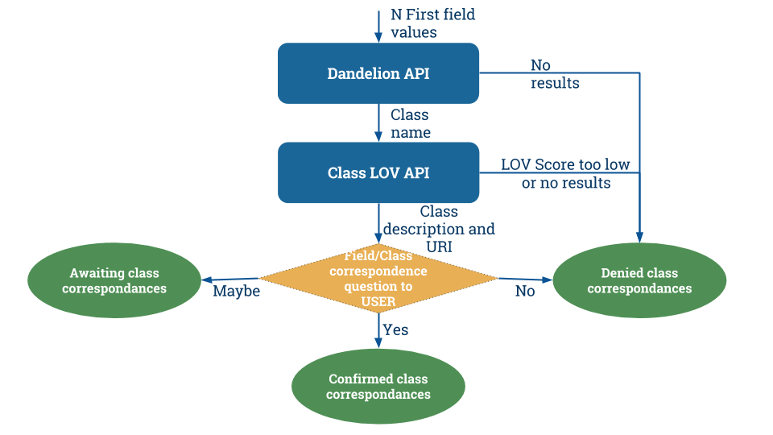
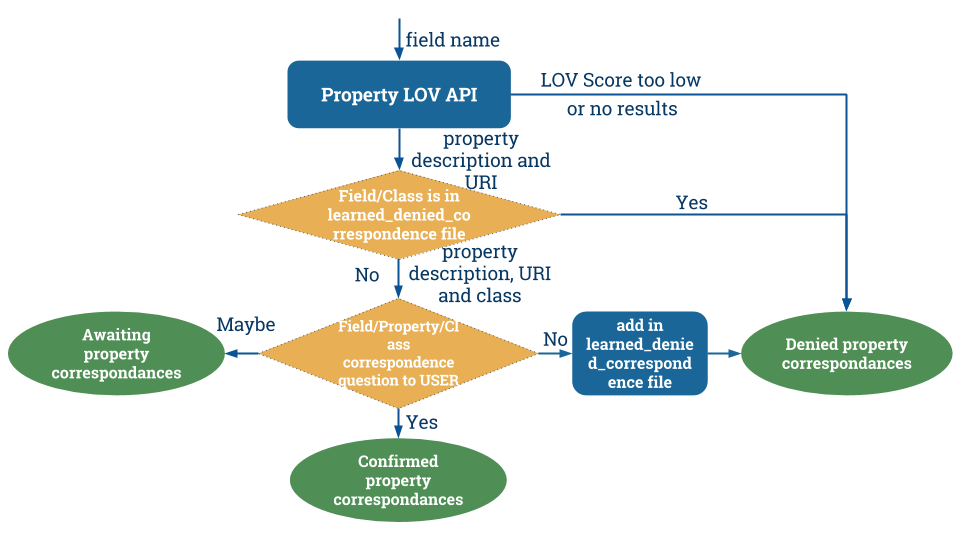

# ontology-mapping-chatbot

Ontology Mapping ChatBot is a  semi-interactive ontology mapping algorithm. It provides an easy-to-use interface (Yes or No questions) in order to semantize (i.e. to map ontologies on) OpenDataSoft datasets.

# Glossary

## DBPedia
DBpedia is wikipedia in RDF format with ontologies to describe resources.
Chatbot uses DBpedia to perform named entity recognition. In other word, to find class of entities (e.g., Italia is a country/PopulatedPLace.. or B.Obama is a President/Person..)

## LOV (Linked Open Vocabularies)
LOV is a ontology search engine. [This API](http://lov.okfn.org/dataset/lov/api) is used by the chatbot to find candidate ontologies for opendatasoft datasets.

## Ontology (The curse word)

An `ontology` is a vocabulary defining the concepts and relationships used to describe an area of concern.
It's composed of:
* `classes` (e.g. Car, Building, Person, Disease, Source Code) to represent a concept.
* `properties` (e.g. horsepower, financed By, date of birth, has Symptoms, Author) to represent relation between concepts.
* `rules` (e.g. A person have a unique date of birth).
Ontologies can be created for every area of concern and by everyone using RDF (Resource Description Framework), RDFS (RDF Schema) and OWL (Web Ontology Language).

## HDT
HDT (Header, Dictionary, Triples) is a compact data structure and binary serialization format for RDF

## RML

RML is a generic mapping language to describe multi-format to RDF transformations.

# Installation
Assuming you already have `python`, `pip`,

create a new virtualenv.

install dependencies with pip (~2 minutes to install hdt)

```bash
pip install -r requirements.txt
```

download `hdt` version of DBPedia instance type dataset and copy .hdt and .index files in `/dbpedia_dump`

# Run the demo
Navigate to ontology-mapping-chatbot folder and execute:

```bash
python manage.py runserver
```

App should be running on [http://127.0.0.1:8000/](http://127.0.0.1:8000/)

Go on [http://127.0.0.1:8000/chatbot/{dataset-id}](http://127.0.0.1:8000/chatbot/dataset-id) and replace `dataset-id` with the Data dataset id you want to semantize.

example: [http://127.0.0.1:8000/chatbot/roman-emperors@public/](http://127.0.0.1:8000/chatbot/roman-emperors@public/)

Semantization result will be stored in the `results` folder in a file named results/{dataset-id}.rml

# API

Chatbot is powered by an API exposed by this service:

## Correspondances API

Correspondences are the semantic correspondences between a dataset's field and an ontology. Fields can be linked to classes (Car, Person, ...) or poroperties of class (Engine horsepower, full name, ...).

`/api/{dataset-id}/correspondances/classes` to retrieve field values/class correspondences (powered by Dandelion API).

`/api/{dataset-id}/correspondances/properties` to retrieve field name/properties correspondences (powered by LOV API).

`/api/{dataset-id}/correspondances/` to retrieve both correspondences.

`/api/{dataset-id}/correspondances/mapping` to translate a set of correspondences into valid RML mapping file.

## Conversation API

Conversations API is used to translate possible correspondences into Human Readable questions.

`/api/conversation/question/class` to ask question about a class/field correspondence.

`/api/conversation/question/property` to ask question about a property/field correspondence.

`/api/conversation/question/property-class` to ask question about a class/property correspondence.

`/api/conversation/greeting` to welcome the user.

`/api/conversation/instructions` instructions to use the chatbot.

`/api/conversation/answer/positive` chatbot response to positive user input.

`/api/conversation/answer/neutral` chatbot response to neutral user input.

`/api/conversation/answer/negative` chatbot response to negative user input.

`/api/conversation/salutation` to say goodbye to the user.

## Named Entity Recognition API

`/api/ner?q=[query]&lang=[language]` returns the class of the term in the query.

# Clubhouse

[Link](https://app.clubhouse.io/opendatasoft/epic/11656) to Clubhouse story

# How it works?
## 1 Class matching
Dandelion API is used to find classes corresponding to dataset's fields using named entity recognition. N-first values of each fields are analysed by Dandelion API and corresponding classes names are returned.

Each class name is sent to Class LOV API. Class LOV API returns class URI and class description. Those informations are stored in chatbot's candidate correspondances dict.

Using class description and field name, class/field associations are proposed to the user. A positive answer dispatch correspondance in chatbot's confirmed correspondance dict. A negative answer dispatch it in denied correspondance dict. Empty answer dispatch it in awaiting correspondance dict.

the following figure illustrate the class matching process.



## 2 Property matching
The goal of this step is to associate properties to already confirmed classes (e.g. full name of a Person?, full name of a car?, etc.)

Property LOV API is used to retrieve find associate field_name to property and to retrieve corresponding URI and description.

A learned_denied_correspondances json file is shared across dataset. This file is used to reduce the number of questions asked to the user by learning from previous user semantisation.

Using property description, each class/property correspondance that is not in learned_denied_correspondances file is proposed to the user. A positive answer dispatch correspondance in chatbot's confirmed correspondance dict. Empty answer dispatch it in awaiting correspondance dict. Negative answer dispatch it in denied correspondance dict and stores it into learned_denied_correspondances json file.

the following figure illustrate the property matching process.


